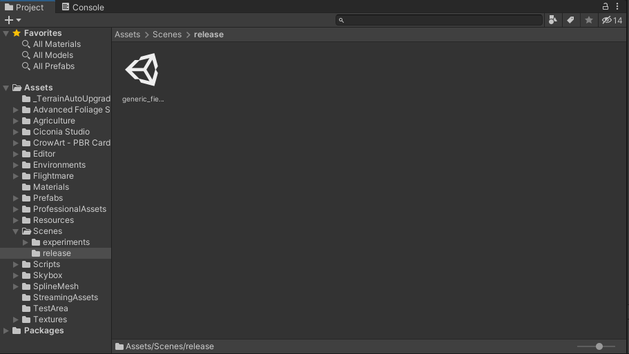
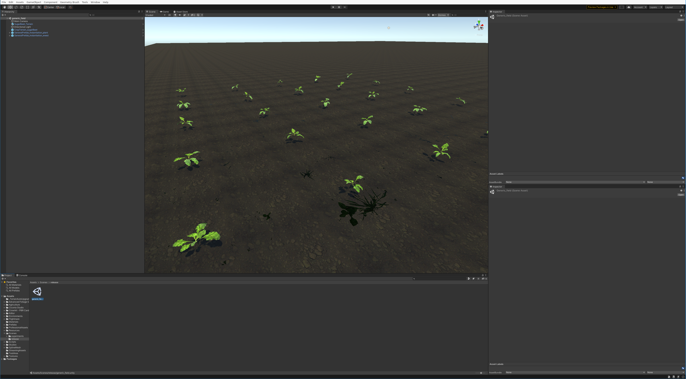

.. _level_demonstration_1:

Generic_Field
=============

The level *generic_field* is used to show how you can spawn your fields, change channels and take
basic snapshots with labeled plants. Additional levels will be used to automate the camera movement
and field respawn for data gathering.

To open the field just double click the level. When you open it, it shows a basic level with a small
field of sugar beets and some weeds. The brightness of these is varied due the nature of the
textures, during experiments these are adjusted with the material settings to achieve an aspect
aligned with the real images available.

The level is made of a couple of top GameObjects or "`prefabs <https://docs.unity3d.com/Manual/Prefabs.html>`_". 

* **The directional light** acts as the sun illumination.
* **The camera** handles the data gathering (camera snapshot).
* **The terrains** There are two terrains from different sugar beet fields, if you prefer one over
  the other you can just switch their positions (one is hidding below the other).
* **The GenralPrefab_instantiation_plant** spawns the sugar beets.
* **The GenralPrefab_instantiation_weeds** spawns the weeds.

.. include:: ../components/genericPrefab_instantiation.rst

You can play around with each of the options in the inspector to see how the field can react. After
modifying a setting click in *Update Instantiation* and the field will respawn considering your new
conditions. Furthermore, you can switch the plant channel:

* **Update Instatiation:** Respawns the field with the current field conditions.
* **Switch To RGB:** Switch plants to their RGB version.
* **Switch To NIR:** Switch plants to their NIR version.
* **Switch To TAG:** Switch plants to their TAG version (pixel label mask).

Consider that you can hover each field with your mouse to get a "tip" on what the variable does.

