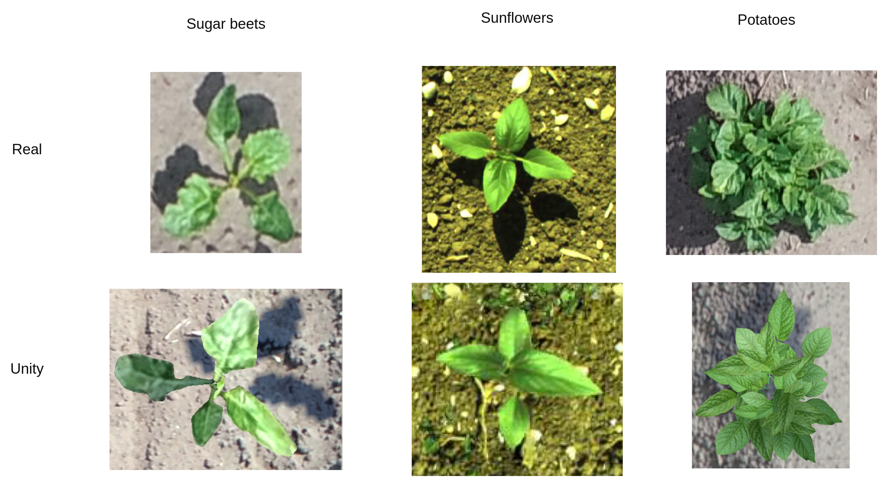

# AgroUnity

AgroUnity is a photorealistic simulator, based on [Unity]({{ site.data.links.unity.main }}), developed for the generation of precision agriculture imagery for training of convolutional neural networks (CNNs) to be implemented in autonomous robots in farms.

## Reference websites

This webpage gives a demonstration of what AgroUnity can do.

For installation visit [AgroUnity's github wiki]({{ site.data.links.agroUnity.wiki_installation }}).

For use documentation visit [AgroUnity's readthedocs documentation]({{ site.data.links.agroUnity.documentation }}).

## Publications

The performance of AgriUnity has been tested on multiple scientific experiments during the PhD development of Carlos Carbone in La Sapienza University of Rome. The results have been published in the following papers

* [Simulation of near Infrared Sensor in Unity for Plant-weed Segmentation Classification](https://www.semanticscholar.org/paper/Simulation-of-near-Infrared-Sensor-in-Unity-for-Carbone-Potena/1999b23a7080c7248477f6da1a8b8b260eb7b918)

* [Augmentation of Sunflower-Weed Segmentation Classification with Unity Generated Imagery Including Near Infrared Sensor Data](https://rd.springer.com/chapter/10.1007/978-3-030-84811-8_3)

In our simulator we have been able to photorealisticly simulate **sugar beets**, **potatoes** and **sunflowers**. Preview images are shown on the following images:

The plants are spwaned procedurally and with additional scripts a complete field with multiple
channels can be created.

In the simulator you can create your own fields. We are currently working on developing a more user friendly setup for custom fields

## Other simulators

We developed AgriUnity to work in tandem with a swarm simulator that combines Gazebo with Unity. We call this simulator with high fidelity visuals and dynamics AgroSwarm

Check more at the [AgroSwarm website]({{ site.data.links.agroSwarm.website }})

Additional developed tools can be found at: 

[Swarm Robotics for Precision Agriculture]({{ site.data.links.swarmRobotics.website }})
